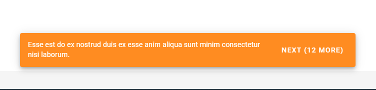

[](https://www.paypal.me/idmarinas)
[](https://liberapay.com/IDMarinas/donate)
[](https://twitter.com/idmarinas)

# Snackbar queue for Vuetify



## Install
```bash
npm install @idmarinas/snackbar-queue-vuetify
```

## Use as plugin
```javascript
import Vue from 'vue'
import IdmSnackbarQueue from '@idmarinas/snackbar-queue-vuetify'

Vue.use(IdmSnackbarQueue)
```

```vue
<template>
    <IdmSnackbarQueue
        :items="items"
        @remove-idm-snackbar-item="removeItem"
    />
</template>
```

## Example
[Demo of Snackbar Queue](https://idmarinas.github.io/snackbar-queue-vuetify/)